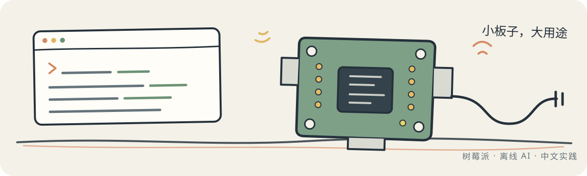

  

# 嗨，我是 zwuyang9

喜欢把看起来很复杂的东西拆开，整理成可以一步步跑通的路线。

最近在折腾 **树莓派、离线 AI 和本地化部署**。这里会慢慢放一些真正用过、值得留下来的代码和笔记。

## 现在在做

### [raspberry-pi-mastery-cn](https://github.com/zwuyang9-commits/raspberry-pi-mastery-cn)

> 一套中文树莓派实践课程：从装好系统开始，一步步搭起离线智能中枢。

它不只记录“输入哪条命令”，也尽量说清为什么这样做、哪些坑容易遇到，以及出问题后怎么往回找。

最近补了 DHT22/BME280 环境采集、本地告警控制台和能源调度的几个边界问题。代码先把接口和
失败路径留清楚，真机上没有跑过的部分也会直接写明。当前版本见
[`v0.2.0`](https://github.com/zwuyang9-commits/raspberry-pi-mastery-cn/releases/tag/v0.2.0)。

`Raspberry Pi` · `Linux` · `离线 AI` · `中文教程` · `可复现实践`

## 做东西时，我比较在意

- **先跑通，再变漂亮。** 可用比看起来厉害更重要。
- **能离线，就少一份依赖。** 本地优先，也更知道数据去了哪里。
- **步骤要能复现。** 把环境、前提和失败路径一起写下来。
- **中文技术资料也可以很扎实。** 不只做翻译，更希望把经验讲明白。

---

仓库还不多。我想先把手上的东西做实，再慢慢往这里搬。
